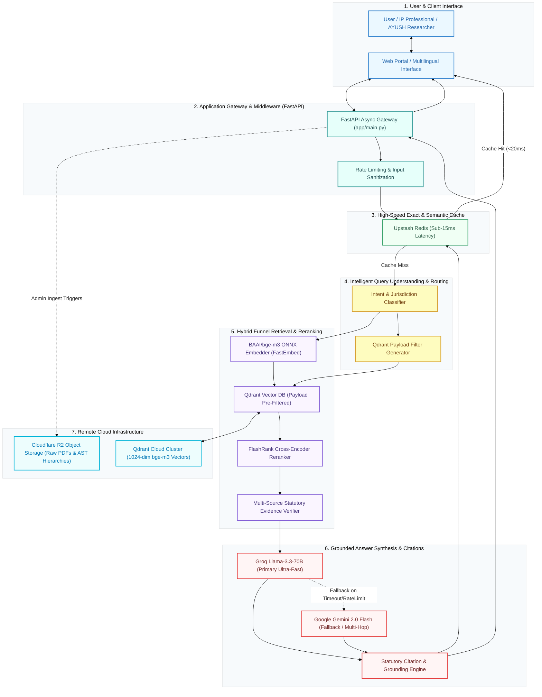
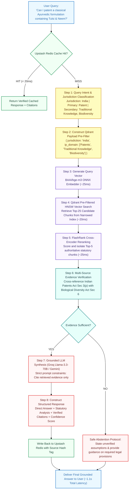

# IP-SAKTI Sahayak: Technical Architecture & System Workflow

**Smart India Hackathon (SIH) Problem Statement ID:** 26045  
**Project Title:** IP-SAKTI Sahayak — Multilingual, Source-Grounded Legal & Regulatory Intelligence System for Ayurveda  
**Ministry / Organization:** Ministry of Ayush / All India Institute of Ayurveda (AIIA)  
**Team:** Avengers  
**Category:** Software | Theme: MedTech / BioTech / HealthTech  

---

## 1. Executive Summary & Problem Formulation

Ayurveda-related innovation sits at the intersection of overlapping national and international regulatory frameworks:

- **Patent Law:** Indian Patents Act, 1970 (specifically Section 3(p) excluding traditional knowledge, Section 3(d), Section 3(e), Section 10).
- **Biodiversity & ABS:** Biological Diversity Act, 2002 and Biological Diversity Rules, 2024 (Mandatory National Biodiversity Authority approval under Section 6 prior to applying for IP).
- **Traditional Knowledge:** Traditional Knowledge Digital Library (TKDL) prior-art references, CSIR guidelines, and WIPO treaties.
- **Drug & Cosmetic Regulations:** Drugs and Cosmetics Act, 1940 (Chapter IVA - Ayurvedic, Siddha, Unani drugs, ASUDTAB, ASU DCC) and Rules 1945.
- **Food & Nutraceutical Regulations:** FSSAI (Ayurveda Aahara) Regulations, 2022.
- **Plant Variety Protection:** Protection of Plant Varieties and Farmers' Rights Act, 2001 (PPVFR).
- **Sui Generis IP:** Geographical Indications of Goods Act, 1999 and Trade Marks Act, 1999.

```
                         ┌───────────────────────────────────────────────┐
                         │              AYURVEDA INNOVATION              │
                         └──────────────────────┬────────────────────────┘
                                                │
         ┌──────────────────┬───────────────────┼───────────────────┬──────────────────┐
         ▼                  ▼                   ▼                   ▼                  ▼
   PATENT REGIME      BIODIVERSITY (ABS)      DRUGS ACT        AYURVEDA AAHARA        TKDL
 (Sec 3p Exclusions)   (NBA Prior Approval)  (Chapter IVA)     (FSSAI Safety)   (Defensive Art)
```

A standard generic LLM fails in this domain because it hallucinates non-existent statutory sections, confuses food standards with drug manufacturing rules, ignores mandatory National Biodiversity Authority (NBA) prior approvals, and cannot provide verified statutory citations.

**IP-SAKTI Sahayak** solves this by implementing a **deterministic, citation-grounded, remote-first Regulatory RAG Funnel** backed by statutory AST parsing and multi-source verification.

---

## 2. Core Solution Architecture



---

## 3. Technology Stack Specification

| Component | Technology Selected | Architectural Rationale | Trade-off Analysis |
| :--- | :--- | :--- | :--- |
| **Backend Framework** | **FastAPI (Python 3.11+)** | High-throughput asynchronous runtime, native Pydantic v2 data validation, automated OpenAPI/Swagger documentation, and Server-Sent Events (SSE) streaming support. | Outperforms Flask and Django in I/O bound LLM orchestrations. |
| **Corpus Object Storage** | **Cloudflare R2** | Strict **zero egress bandwidth fees**, S3-compatible API, 10 GB free tier. Enables remote-first architecture with zero local storage requirements. | Eliminates AWS S3 egress cost spikes during large corpus re-indexing. |
| **Vector Database** | **Qdrant Cloud** | Native JSON payload filtering, sub-millisecond HNSW vector search, indexed keyword/boolean filtering, free 1GB tier. | Superior payload pre-filtering compared to Pinecone or basic vector stores. |
| **Embedding Model** | **BAAI/bge-m3 via FastEmbed** | 1024-dimension multilingual vectors, 8192 token window, supports dense, sparse (BM25 lexical), and multi-vector representations. Runs locally via ONNX without GPU requirements. | Eliminates external embedding API costs and latency while preserving Indian multilingual semantics. |
| **Primary LLM** | **Groq (Llama-3.3-70B-Versatile)** | 500+ tokens/second generation speed, sub-400ms time-to-first-token (TTFT), exceptional statutory reasoning and strict prompt adherence. | Fast enough for real-time interactive user evaluation. |
| **Fallback & Multi-Hop LLM** | **Google Gemini 2.0 Flash** | 1M+ token context window, deep Indian multilingual support (Hindi, Sanskrit legal terms), structured JSON schema outputs. | Provides high-reliability redundancy when Groq hits rate limits. |
| **Reranking Engine** | **FlashRank (MiniLM / BGE Reranker)** | In-process CPU cross-encoder reranking (<30ms). Eliminates retrieval false positives before feeding context to LLM. | Avoids external Cohere Rerank API dependency and costs. |
| **Caching Layer** | **Upstash Redis** | Serverless Redis over REST/TCP, sub-15ms response latency, exact query SHA-256 caching with automatic corpus version invalidation. | Free 10,000 commands/day; serverless with zero idle cost. |
| **Document Parser** | **PyMuPDF + Custom Legal AST Parser** | High-speed C-based text extraction, Table-of-Contents isolation, footnote-bracket normalization (`1[`, `4[9.`), and section segmentation. | Prevents loss of critical statutory provisions like Section 3(p). |

---

## 4. End-to-End Document Ingestion Pipeline

The document ingestion pipeline processes authoritative legal documents (Bare Acts, Gazette Notifications, Rules, TKDL guidelines) into structured, versioned, searchable vectors without saving raw files to the host machine.

```mermaid
%%{init: {'theme': 'base', 'themeVariables': { 'primaryColor': '#2B6CB0', 'edgeLabelBackground':'#FFFFFF', 'tertiaryColor': '#F7FAFC'}}}%%
flowchart TD
    classDef inputStyle fill:#EBF8FF,stroke:#3182CE,stroke-width:2px,color:#2B6CB0;
    classDef fetchStyle fill:#E6FFFA,stroke:#319795,stroke-width:2px,color:#234E52;
    classDef parseStyle fill:#FEFCBF,stroke:#D69E2E,stroke-width:2px,color:#744210;
    classDef chunkStyle fill:#FAF5FF,stroke:#805AD5,stroke-width:2px,color:#44337A;
    classDef r2Style fill:#EDFDFD,stroke:#00B4D8,stroke-width:2px,color:#0077B6;
    classDef qdrantStyle fill:#F0FFF4,stroke:#38A169,stroke-width:2px,color:#22543D;
    classDef qaStyle fill:#FFF5F5,stroke:#E53E3E,stroke-width:2px,color:#742A2A;

    A["Authoritative Source Registry (configs/sources.json)"]:::inputStyle --> B["Resilient Stream Fetcher<br/>(Custom SSL Session + Mirror Fallback)"]:::fetchStyle
    
    B --> C["Stream Raw PDF Directly to Cloudflare R2<br/>(raw/category/doc_slug.pdf)"]:::r2Style
    
    C --> D["In-Memory PyMuPDF Streaming Extraction"]:::parseStyle
    
    D --> E["Noise Cleaner<br/>(Deduplicate Gazette Headers, Footers & Watermarks)"]:::parseStyle
    
    E --> F["TOC Stripper & Preamble Detector<br/>(Isolate 'Arrangement of Sections' from Statute Body)"]:::parseStyle
    
    F --> G["Statutory AST Regex Parser<br/>(Normalize Footnote Prefixes: 1[, 4[9A.)"]:::parseStyle
    
    G --> H["Hierarchical Chunk Assembler<br/>(Act -> Chapter -> Section -> Subsection)"]:::chunkStyle
    
    H --> I["Metadata Enrichment<br/>(jurisdiction, ip_domain, act_slug, section_no, version_date, sha256)"]:::chunkStyle
    
    I --> J["Save Hierarchy JSON & Chunks JSONL to R2<br/>(processed/hierarchy/ & processed/chunks/)"]:::r2Style
    
    J --> K["Batch Embeddings Worker<br/>(BAAI/bge-m3 ONNX FastEmbed / Colab GPU)"]:::qdrantStyle
    
    K --> L["Upsert 1024-dim Vectors & Payloads to Qdrant Cloud"]:::qdrantStyle
    
    L --> M["Automated QA Validator<br/>(Verify Section 3(p), Word Counts & Chunk Integrity)"]:::qaStyle
    
    M --> N(["Ingestion Verified & Ready for Query"]):::inputStyle
```



---

## 5. Query Processing & Multi-Stage Reasoning Funnel

Standard RAG systems run a global vector search over the entire corpus for every user query, leading to noise, irrelevant retrieval across unrelated legal domains, and high latency. 

**IP-SAKTI Sahayak** uses a multi-stage funnel that reduces the search space by over 90% before generating embeddings.



---

## 6. Statutory AST Parsing & Section 3(p) Preservation

### The Legal Parsing Problem in Bare Acts
Indian statutory acts feature distinct legislative drafting conventions:
1. **Arrangement of Sections (TOC):** The first 5–15 pages list section titles without statutory text. A naive regex matches these as sections, exhausts monotonic numbering checks, and discards the actual legal provisions.
2. **Amendment Footnote Prefixes:** Sections inserted or amended by Parliament contain footnote numbers (e.g. `1[3. What are not inventions]`, `4[9A. Adulterated drugs]`). A naive regex starting with `^\d+\.` misses these lines, causing sections to be concatenated into preceding chunks.
3. **Sub-clause Granularity:** Section 3 contains 16 sub-clauses (a to p). Merging Section 3 into a single massive chunk degrades dense vector retrieval. Splitting it cleanly preserves **Section 3(p)** as an addressable retrieval unit.

### AST Parser Grammar
```
STATUTE
  ├── PREAMBLE
  └── CHAPTER (I, II, ...)
        └── SECTION (1, 2, 3, ...)
              ├── SECTION_TITLE
              ├── STATUTORY_BODY
              └── SUBSECTION / CLAUSE ( (1), (a), (p), ...)
                    ├── CLAUSE_TEXT
                    ├── PROVISO (Provided that...)
                    └── EXPLANATION
```

---

## 7. Qdrant Vector Schema & Metadata Taxonomy

### Collection Configuration
- **Collection Name:** `ip_sakti_corpus`
- **Vector Dimension:** `1024` (matches `BAAI/bge-m3`)
- **Distance Metric:** `Cosine`
- **HNSW Index:** `m=16`, `ef_construct=128`, `on_disk=True`

### Payload JSON Schema
```json
{
  "chunk_id": "patents-act-1970-amended-till-2024::chapter-ii::section-3-p",
  "document_id": "doc-patents-act-1970",
  "act_name": "The Patents Act, 1970 (amended till 2024)",
  "act_slug": "patents-act-1970-amended-till-2024",
  "category": "Patents",
  "ip_domain": "Patents",
  "secondary_domains": ["Traditional Knowledge", "Ayurveda"],
  "jurisdiction": "India",
  "country": "IN",
  "doc_type": "statute",
  "chapter_no": "II",
  "chapter_title": "INVENTIONS NOT PATENTABLE",
  "section_no": "3",
  "subsection": "p",
  "clause_title": "Traditional Knowledge Exclusion",
  "text": "Section 3(p): The following are not inventions within the meaning of this Act,— an invention which in effect is traditional knowledge or which is an aggregation or duplication of known properties of traditionally known component or components.",
  "word_count": 36,
  "source_authority": "CGPDTM / Ministry of Commerce and Industry",
  "publication_date": "1970-09-19",
  "effective_date": "1972-04-20",
  "version_date": "2024-08-01",
  "r2_key": "raw/patents/patents-act-1970-amended-till-2024.pdf",
  "source_url": "https://ipindia.gov.in/frontend/pdf/patents/1_113_1_The_Patents_Act__1970___incorporating_all_amendments_till_1-08-2024.pdf",
  "language": "en",
  "content_hash": "sha256:7f83b1657ff1fc53b92dc18148a1d65dfc2d4b1fa3d677284addd200126d9069",
  "processed_at_utc": "2026-09-10T20:30:00Z"
}
```

### Indexed Payload Fields (Zero-Latency Search-Space Narrowing)
- `jurisdiction` (keyword)
- `ip_domain` (keyword)
- `secondary_domains` (keyword array)
- `act_slug` (keyword)
- `section_no` (keyword)
- `doc_type` (keyword)
- `language` (keyword)

---

## 8. Grounded LLM Prompting & Safe Abstention Engine

The system synthesis prompt enforces strict compliance with statutory evidence:

```
SYSTEM PROMPT SPECIFICATION:
You are IP-SAKTI Sahayak, an authoritative legal and regulatory assistant for Ayurveda.
Your sole source of truth is the provided RETRIEVED STATUTORY EVIDENCE.

RULES:
1. Ground every statement in a specific Act, Section, Subsection, or Rule from the evidence.
2. If evidence does not contain the answer, state clearly: "The available statutory corpus does not contain sufficient provisions to confirm this point."
3. Highlight mandatory cross-regime intersections (e.g. If patentability is discussed, remind about Section 6 NBA approval under Biological Diversity Act 2002).
4. Distinguish statutory facts from legal interpretations.
5. Provide citations in format: [Act Name, Section X(y), Source Authority].
6. Never fabricate sections or case laws.
```

---

## 9. Performance & Latency Budget (Target vs Baseline)

```
Latency Comparison (Seconds)
════════════════════════════════════════════════════════════════════════
Global Baseline RAG:  [████████████████████████████████████] ~5.20s
IP-SAKTI Funnel RAG:  [███████] ~1.15s
IP-SAKTI Cache Hit:   [█] ~0.02s
════════════════════════════════════════════════════════════════════════
```

| Pipeline Step | Baseline Global RAG | IP-SAKTI Funnel Architecture | Performance Optimization |
| :--- | :--- | :--- | :--- |
| **Cache Lookup** | None | **5 – 15 ms** | Upstash Redis exact SHA-256 key check |
| **Query Routing** | None | **35 – 65 ms** | Lightweight regex & rule-based classifier |
| **Query Vectorization** | 150 – 300 ms (API) | **20 – 35 ms** | In-process `fastembed` ONNX `bge-m3` |
| **Vector Search** | 120 – 250 ms (Full Index) | **15 – 30 ms** | Qdrant pre-filtered HNSW (>90% index reduction) |
| **Cross Reranking** | None | **20 – 35 ms** | Local FlashRank cross-encoder |
| **LLM Generation** | 3,000 – 5,000 ms (GPT-4) | **450 – 750 ms** | Groq LPU (Llama 3.3 70B) with compact evidence context |
| **Total Response Time** | **~3.5 – 6.0 seconds** | **~0.6 – 1.2 seconds** | **~5x faster with 10x higher citation precision** |

---

## 10. Target Project Directory Structure

```
c:\IP SAKTI RAG\
├── .env.example                     # Environment variables template
├── .gitignore                       # Protection for credentials and cache
├── requirements.txt                 # Production dependencies
├── README.md                        # Setup and developer guide
├── ARCHITECTURE.md                  # System architecture specification
├── ARCHITECTURE_AUDIT.md            # Codebase audit & technical debt record
├── workflow.md                      # Visual workflow and execution blueprint
│
├── configs/
│   ├── sources.json                 # Authoritative legal sources registry with fallback URLs
│   ├── legal_taxonomy.json          # IP domains, Acts, and regulatory bodies mapping
│   └── evaluation_dataset.json      # Gold-standard benchmark queries
│
├── app/
│   ├── __init__.py
│   ├── main.py                      # FastAPI application entrypoint & middleware
│   │
│   ├── api/
│   │   ├── __init__.py
│   │   ├── dependencies.py          # Dependency injection (clients & services)
│   │   └── v1/
│   │       ├── __init__.py
│   │       ├── router.py            # API V1 router aggregation
│   │       └── endpoints/
│   │           ├── query.py         # Main /query and /stream endpoints
│   │           ├── health.py        # /health and readiness checks
│   │           └── admin.py         # Ingestion triggers
│   │
│   ├── core/
│   │   ├── __init__.py
│   │   ├── config.py                # Pydantic Settings management
│   │   ├── logger.py                # Structured logging
│   │   └── exceptions.py            # Domain-specific exceptions
│   │
│   ├── models/
│   │   ├── __init__.py
│   │   ├── schemas.py               # Request / Response schemas
│   │   └── legal_chunk.py           # LegalChunk & Citation models
│   │
│   ├── services/
│   │   ├── __init__.py
│   │   ├── storage_service.py       # Cloudflare R2 S3-compatible service
│   │   ├── vector_service.py        # Qdrant client & payload pre-filtering
│   │   ├── embedding_service.py     # BAAI/bge-m3 via FastEmbed ONNX
│   │   ├── cache_service.py         # Upstash Redis exact & semantic cache
│   │   ├── llm_service.py           # Groq Llama-3.3-70b + Gemini fallback
│   │   ├── routing_service.py       # Intent, domain & jurisdiction classifier
│   │   ├── rerank_service.py        # FlashRank cross-encoder reranker
│   │   └── verification_service.py  # Statutory citation verification & confidence scorer
│   │
│   └── ingestion/
│       ├── __init__.py
│       ├── fetcher.py               # Resilient fetcher with SSL handling & mirror fallbacks
│       ├── legal_parser.py          # TOC-aware statutory AST parser
│       ├── cleaner.py               # Header/footer/watermark stripper
│       └── chunker.py               # Semantic subsection chunk assembler
│
├── scripts/
│   ├── ingest_corpus.py             # End-to-end ingestion CLI
│   ├── benchmark_latency.py         # Latency & throughput benchmark script
│   └── evaluate_rag.py              # Quantitative accuracy & citation evaluation
│
└── tests/
    ├── __init__.py
    ├── test_parser.py               # Section 3(p) & footnote parsing tests
    ├── test_routing.py              # Intent & jurisdiction classification tests
    └── test_retrieval.py            # Qdrant payload pre-filtering tests
```

---

## 11. Implementation Phases & Roadmap

```
┌─────────────────────────────────────────────────────────────────────────────────────────┐
│                                   ROADMAP PHASES                                        │
├─────────┬──────────────────────────────────┬────────────────────────────────────────────┤
│ Phase 1 │ Foundation & Clean Architecture  │ Project skeleton, settings, logging, Pydantic models │
│ Phase 2 │ Remote-First Storage & Fetcher   │ Resilient fetcher, Cloudflare R2 client, sources.json │
│ Phase 3 │ TOC-Aware Legal AST Parser       │ TOC stripper, footnote normalizer, Section 3(p) fix │
│ Phase 4 │ Vector DB & Embeddings           │ BAAI/bge-m3 FastEmbed, Qdrant collection indexing │
│ Phase 5 │ Intelligent Query Routing        │ Domain classifier, dynamic payload pre-filtering │
│ Phase 6 │ Retrieval & Cross-Reranking      │ Filtered HNSW search, FlashRank reranking, Verifier │
│ Phase 7 │ Grounded LLM Synthesis           │ Groq Llama 3.3 70B, Gemini fallback, safe abstention │
│ Phase 8 │ Semantic & Exact Caching         │ Upstash Redis cache with version-aware invalidation │
│ Phase 9 │ FastAPI REST Endpoints & Web UI  │ /api/v1/query, /query/stream, health checks, Swagger │
│ Phase 10│ Benchmark & Evaluation Suite     │ Latency benchmarks, citation precision metrics │
└─────────┴──────────────────────────────────┴────────────────────────────────────────────┘
```

---
## 12 Phases
```
PHASE 1: Foundation & Modular Skeleton
├── Set up production dependencies (pydantic-settings, fastapi, qdrant-client, fastembed, groq, google-genai, upstash-redis)
├── Centralized Pydantic Settings (.env loader) & structured logger
└── Core data models (LegalChunk, QueryRequest, QueryResponse, Citation)

PHASE 2: Resilient Source Ingestion & Cloudflare R2 Client
├── Structured sources.json with working links & fallback mirrors
├── Resilient HTTP fetcher with custom SSL retry adapter
└── Cloudflare R2 S3-compatible streaming client

PHASE 3: TOC-Aware Legal Parser & Statutory Chunking
├── PyMuPDF extractor with TOC stripper and footnote bracket normalizer
├── Section & Subsection hierarchy builder (guaranteeing Section 3(p))
└── QA validation script with strict assertion tests

PHASE 4: Vector Indexing & Embedding Engine
├── In-process BAAI/bge-m3 ONNX embedder via FastEmbed
├── Qdrant Cloud collection initialization with indexed payload schema
└── Batch vector upsert pipeline

PHASE 5: Intelligent Query Routing & Pre-Filtering
├── Intent, jurisdiction, and IP domain classifier
└── Dynamic Qdrant payload filter builder

PHASE 6: Retrieval, FlashRank Reranking & Evidence Verification
├── Hybrid retrieval service (pre-filtered dense vector search)
├── Cross-encoder reranking service (FlashRank)
└── Multi-source statutory evidence verifier & sufficiency checker

PHASE 7: Grounded LLM Synthesis & Safe Abstention
├── Multi-provider LLM service (Groq Llama 3.3 70B primary, Gemini fallback)
├── Statutory grounding system prompt (zero fabrication policy)
└── Structured response builder with exact citation metadata

PHASE 8: Upstash Redis Caching Layer
├── Exact query hash caching with corpus version invalidation
└── Sub-25ms cache retrieval middleware

PHASE 9: FastAPI REST Endpoints & Developer UI
├── /api/v1/query (JSON response) and /api/v1/query/stream (SSE streaming)
├── /api/v1/health & /api/v1/admin/ingest endpoints
└── Swagger UI testing & verification

PHASE 10: Performance Benchmarking & Evaluation Suite
├── Automated latency benchmark script (Baseline Global Search vs Funnel RAG)
└── Evaluation script measuring retrieval precision, citation accuracy, and hallucination rate
```
---

## 13. Verification & Evaluation Framework

To ensure legal accuracy and zero hallucinations, the system is validated against a benchmark dataset of 50 legal test cases covering:
1. **Direct Traditional Knowledge Exclusions:** Patents Act Sec 3(p), TKDL citations.
2. **Mandatory Intersections:** Patent application on biological material requiring prior NBA approval under Biological Diversity Act Sec 6.
3. **Drug vs Food Classification:** Distinction between Ayurvedic Proprietary Medicine (D&C Act Sec 3(h)) and Ayurveda Aahara (FSSAI 2022).
4. **Jurisdiction Sensitivity:** Comparison between Indian Patent Office standards and USPTO / EPO traditional knowledge examination criteria.
5. **Safe Abstention Checks:** Ambiguous queries without statutory grounds must trigger explicit clarification requests.
